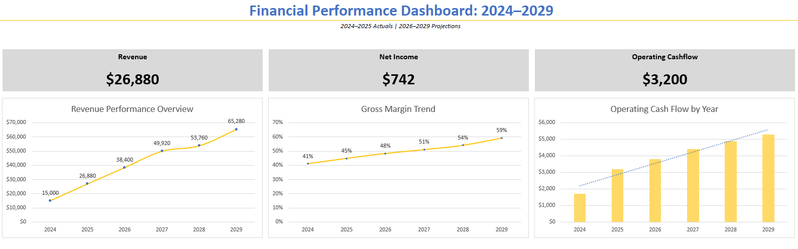

# 🍓 Smoothie Shop 3-Statement Financial Model

## 📌 Overview  
This project showcases a fully built from scratch 3-statement financial model in Excel for a fictional smoothie shop. It includes complete forecasting, CapEx planning, depreciation schedules, and a dynamic dashboard for executive-level presentation.

Designed to simulate a real-world FP&A deliverable, the model allows users to analyze operating performance, assess profitability, and visualize key trends over a multi-year horizon.

---

---

### 📥 [Download the Excel File](https://raw.githubusercontent.com/sbrown-analytics/3-statement-smoothie-model/main/SB_Smoothie_3_Statement_Financial_Model.xlsx)

> ⚠️ For full functionality (dashboard + charts), download and open in **Excel Desktop**. Online previews won't display correctly.

---

## 🧠 Key Features

### 🔢 Income Statement  
- Gross Revenue  
- Net Revenue  
- Cost of Goods Sold:  
  - Raw Materials  
  - Fulfillment  
  - Transaction Fees  
- Total COGS  
- Gross Profit & Gross Profit Margin  
- Operating Expenses & Total OpEx  
- EBITDA  
- Depreciation & Amortization  
- EBIT, EBT, and Net Income

---

### 🧾 Balance Sheet  
- **Current Assets**:  
  - Cash  
  - Accounts Receivable  
- **Non-Current Assets**:  
  - Fixed Assets  
  - Accumulated Depreciation  
- **Liabilities**:  
  - Current & Non-Current  
- **Equity**:  
  - Common Stock  
  - Retained Earnings  
- **Check**:  
  - Balance Check to ensure Assets = Liabilities + Equity

---

### 💵 Cash Flow Statement  
- Net Income  
- Operating Activities Adjustments:  
  - Depreciation  
  - Change in A/R  
  - Change in A/P  
  - Change in Deferred Revenue  
- Operating Cash Flow  
- Investing Activities:  
  - Capital Expenditures (CapEx)  
- Financing Activities:  
  - Debt Repayment  
  - Net Borrowings  
- Net Cash Flow & Ending Cash

---

## 🛠️ Supporting Tabs and Logic

### 🏗️ Fixed Asset Schedule  
- Line-item CapEx for major equipment:  
  - Blender Station  
  - Flash Freezer  
  - Dairy Refrigerator  
  - POS System  
- Straight-line depreciation applied per asset life  
- Fully linked to Balance Sheet and Cash Flow Statement

---

## 📊 Dashboard Overview

A professionally formatted dashboard designed for investor or executive review.

### 🎯 KPI Cards  
- Revenue  
- Net Income  
- Operating Cash Flow

### 📈 Charts  
- **Revenue Performance Overview**  
- **Gross Margin Trend**  
- **Operating Cash Flow by Year**

Each KPI card sits above its related chart for clear storytelling.

---

## 📬 Let’s Connect  

💼 Resume available upon request
